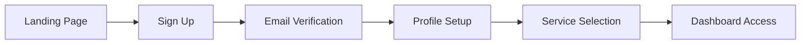
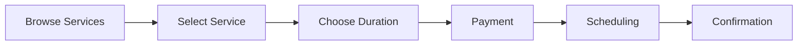
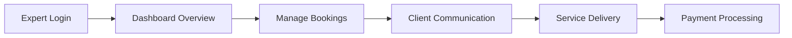
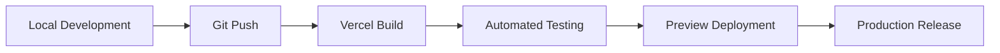

# 🚀 Blockchain Consultant Platform - Project Development Lifecycle

*A comprehensive overview of the Diligence Labs blockchain consultancy platform*

---

## 📋 Executive Summary

The **Diligence Labs Blockchain Consultant Platform** is a sophisticated, enterprise-grade web application designed to connect blockchain projects with expert consultants. Built with modern web technologies and premium UI/UX design, the platform serves as a comprehensive solution for blockchain advisory services, due diligence, and strategic consultation.

### 🎯 Key Metrics
- **Technology Stack**: Next.js 14, React 18, TypeScript, Tailwind CSS
- **Database**: PostgreSQL with Prisma ORM
- **Authentication**: Multi-modal (Email, OAuth, Web3 Wallet)
- **Design System**: Modern glassmorphism with consistent theming
- **Deployment**: Vercel with CI/CD pipeline
- **Security**: Enterprise-grade with JWT, encryption, and rate limiting

---

## 🌟 Project Vision & Concept

### Mission Statement
To democratize access to high-quality blockchain expertise by creating a seamless platform that connects innovative projects with seasoned blockchain consultants.

### Core Value Propositions
1. **Trust & Credibility**: Professional, secure platform that builds confidence
2. **Expertise Access**: Direct connection to verified blockchain experts
3. **Streamlined Process**: Simplified consultation booking and management
4. **Comprehensive Services**: Full spectrum from strategy to technical implementation
5. **Scalable Solution**: Enterprise-ready platform for growing market demands

### Target Market
- **Primary**: Early to mid-stage blockchain projects seeking expert guidance
- **Secondary**: Established projects requiring specialized consultation
- **Tertiary**: Individual entrepreneurs and developers in the blockchain space

---

## 🏗️ Technical Architecture

### Core Technology Stack

#### Frontend Architecture
```typescript
Framework: Next.js 14 (App Router)
├── React 18 (Server Components + Client Components)
├── TypeScript (Type Safety)
├── Tailwind CSS (Styling)
├── Framer Motion (Animations)
├── shadcn/ui (Component Library)
└── React Hook Form + Zod (Form Management)
```

#### Backend Architecture
```typescript
API Layer: Next.js API Routes
├── NextAuth.js (Authentication)
├── Prisma ORM (Database)
├── PostgreSQL (Primary Database)
├── Stripe (Payment Processing)
└── JWT (Session Management)
```

#### Infrastructure & Deployment
```yaml
Hosting: Vercel
├── Edge Runtime Functions
├── Automatic CI/CD Pipeline
├── Environment Management
├── Performance Analytics
└── Global CDN Distribution
```

### System Architecture Diagram
```
┌─────────────────┐    ┌─────────────────┐    ┌─────────────────┐
│   Client App    │    │   Next.js API   │    │   PostgreSQL    │
│  (React/TS/TW)  │◄──►│     Routes      │◄──►│    Database     │
└─────────────────┘    └─────────────────┘    └─────────────────┘
         │                       │                       │
         │                       │              ┌─────────────────┐
         │                       └─────────────►│  External APIs  │
         │                                      │ (Stripe, OAuth) │
         │                                      └─────────────────┘
         │
┌─────────────────┐
│  Web3 Wallets   │
│ (MetaMask, etc) │
└─────────────────┘
```

---

## 🎨 Design System & UI/UX

### Design Philosophy
**"Premium Glassmorphism with Purposeful Sophistication"**

Our design system embodies trust, innovation, and professionalism through:
- Modern glassmorphic aesthetics
- Consistent interaction patterns
- Accessible contrast ratios
- Micro-animations for enhanced UX

### Color Palette
```css
/* Primary Colors */
--slate-900: #0f172a;     /* Primary backgrounds */
--slate-800: #1e293b;     /* Secondary backgrounds */
--slate-700: #334155;     /* Button primary */
--white-05: rgba(255,255,255,0.05);  /* Glassmorphic elements */

/* Accent Colors */
--orange-400: #fb923c;     /* Links and highlights */
--emerald-600: #059669;    /* Success states */
--red-500: #ef4444;        /* Error states */
```

### Typography System
```css
/* Heading Hierarchy */
h1: 3xl font-light (36px, 300 weight)
h2: 2xl font-light (24px, 300 weight)  
h3: xl font-semibold (20px, 600 weight)
body: base font-medium (16px, 500 weight)
caption: sm font-medium (14px, 500 weight)

/* Letter Spacing */
tracking-tight: -0.025em (headers)
tracking-wide: 0.025em (labels)
```

### Component Design System
```typescript
// Form Theme Architecture
formTheme = {
  card: "glassmorphic backgrounds with subtle borders",
  input: "transparent with focus states and rounded corners", 
  button: "solid colors with hover scaling and enhanced shadows",
  typography: "consistent hierarchy with proper contrast",
  spacing: "8px base grid system with responsive scaling"
}
```

### Interaction Patterns
- **Hover Effects**: Subtle scaling (`scale-[1.02]`) and shadow enhancement
- **Focus States**: Clear visual feedback with ring effects
- **Loading States**: Skeleton screens and smooth transitions
- **Error Handling**: Non-intrusive notifications with clear CTAs

---

## 🛠️ Feature Set & User Flows

### Core Features Matrix

| Feature Category | Components | User Benefit |
|-----------------|------------|--------------|
| **Authentication** | Multi-modal login, Session management | Secure, flexible access |
| **Consultation Booking** | Service selection, Payment, Scheduling | Streamlined booking process |
| **Dashboard Management** | Analytics, Session history, Profile | Centralized user control |
| **Payment Processing** | Stripe integration, Subscriptions | Secure, reliable transactions |
| **Expert Matching** | Skill-based matching, Availability | Quality consultant connections |
| **Communication** | In-app messaging, Video calls | Seamless collaboration |

### Primary User Flows

#### 1. New User Onboarding


#### 2. Consultation Booking Flow


#### 3. Expert Dashboard Flow


### Feature Prioritization (MoSCoW Method)

#### Must Have ✅
- User authentication and authorization
- Consultation booking system
- Payment processing integration
- Basic dashboard functionality
- Responsive design implementation

#### Should Have 🔶
- Advanced search and filtering
- In-app messaging system
- Expert verification system
- Analytics and reporting
- Mobile app considerations

#### Could Have 🔵
- AI-powered expert matching
- Video call integration
- Advanced analytics dashboard
- Multi-language support
- API for third-party integrations

#### Won't Have (This Phase) ❌
- Mobile native apps
- Complex AI/ML features
- Enterprise SSO integration
- White-label solutions
- Blockchain-native payments

---

## 📋 Development Methodology

### Agile Development Process

#### Sprint Structure (2-week sprints)
```
Week 1: Planning, Development, Initial Testing
Week 2: Feature Completion, Testing, Review, Deployment
```

#### Quality Assurance Pipeline
1. **Development Phase**
   - TypeScript for type safety
   - ESLint/Prettier for code consistency
   - Component-level testing

2. **Testing Phase**  
   - Unit testing (Jest)
   - Integration testing (Playwright)
   - Manual QA testing
   - Performance testing

3. **Deployment Phase**
   - Staging environment validation
   - Production deployment via Vercel
   - Post-deployment monitoring

### Code Quality Standards

#### TypeScript Implementation
```typescript
// Strict type checking enabled
"strict": true,
"noUncheckedIndexedAccess": true,
"noUnusedLocals": true,
"noUnusedParameters": true
```

#### Component Architecture
```typescript
// Consistent component structure
interface ComponentProps {
  // Required props
  title: string;
  // Optional props  
  className?: string;
  // Event handlers
  onAction?: (data: ActionData) => void;
}

export function Component({ title, className, onAction }: ComponentProps) {
  // Implementation with proper error boundaries
}
```

### Performance Optimization Strategy

#### Frontend Optimization
- **Bundle Splitting**: Dynamic imports for route-based splitting
- **Image Optimization**: Next.js Image component with WebP support
- **Caching Strategy**: Aggressive caching for static assets
- **Core Web Vitals**: Target LCP < 2.5s, FID < 100ms, CLS < 0.1

#### Backend Optimization  
- **Database Indexing**: Optimized queries with proper indexing
- **API Response Caching**: Redis for frequently accessed data
- **Connection Pooling**: Efficient database connection management
- **Rate Limiting**: Prevent abuse and ensure fair usage

---

## 🔐 Security & Compliance

### Security Architecture

#### Authentication Security
```typescript
// Multi-layer authentication approach
Authentication Layers:
├── JWT with secure HTTP-only cookies
├── OAuth 2.0 with trusted providers
├── Web3 wallet signature verification
├── Session rotation and timeout
└── Rate limiting and abuse prevention
```

#### Data Protection
- **Encryption at Rest**: Database-level encryption for sensitive data
- **Encryption in Transit**: HTTPS/TLS 1.3 for all communications
- **PII Handling**: GDPR-compliant personal data processing
- **Payment Security**: PCI DSS compliance through Stripe

#### Security Measures Implemented
```typescript
// Security middleware stack
Security Stack:
├── CSRF Protection (NextAuth.js built-in)
├── XSS Prevention (Content Security Policy)
├── SQL Injection Protection (Prisma ORM)
├── Rate Limiting (per-IP and per-user)
├── Input Validation (Zod schema validation)
└── Security Headers (helmet.js equivalent)
```

### Compliance Framework
- **GDPR**: European data protection regulation compliance
- **CCPA**: California Consumer Privacy Act compliance  
- **SOC 2**: Security and availability controls
- **Privacy by Design**: Data minimization principles

---

## 🚀 Deployment & Infrastructure

### Deployment Architecture

#### Production Environment (Vercel)
```yaml
Infrastructure:
  Platform: Vercel (Serverless)
  Runtime: Node.js 18+
  Database: PostgreSQL (Neon/Supabase)
  CDN: Global edge network
  SSL: Automatic HTTPS with certificate management
  
Performance:
  Edge Functions: Sub-100ms response times
  Global CDN: 99.9% uptime SLA
  Auto-scaling: Automatic based on traffic
  Monitoring: Real-time performance metrics
```

#### Development Pipeline


### Environment Management
```bash
# Environment Variables Structure
├── .env.local (Local development)
├── .env.staging (Staging environment)  
├── .env.production (Production secrets)
└── .env.example (Template for developers)

# Key Environment Variables
DATABASE_URL=postgresql://...
NEXTAUTH_SECRET=...
STRIPE_SECRET_KEY=...
OAUTH_PROVIDERS_CONFIG=...
```

### Monitoring & Analytics
- **Performance**: Vercel Analytics for Core Web Vitals
- **Errors**: Sentry for error tracking and performance monitoring
- **User Analytics**: Privacy-focused analytics (Plausible/Fathom)
- **Security**: Audit logs for authentication and sensitive operations

---

## 📊 Performance & Optimization

### Performance Metrics & Targets

#### Core Web Vitals Targets
```
Largest Contentful Paint (LCP): < 2.5s ✅
First Input Delay (FID): < 100ms ✅  
Cumulative Layout Shift (CLS): < 0.1 ✅
First Contentful Paint (FCP): < 1.8s ✅
```

#### Technical Performance KPIs
- **Bundle Size**: < 250KB initial JS bundle
- **Database Queries**: < 100ms average response time
- **API Response**: < 200ms 95th percentile
- **Uptime**: 99.9% availability target

### Optimization Strategies

#### Frontend Optimizations
```typescript
// Code splitting implementation
const DynamicComponent = dynamic(() => import('./Component'), {
  loading: () => <SkeletonLoader />,
  ssr: false // Client-side only when appropriate
});

// Image optimization
<Image
  src="/consultation.webp"
  alt="Blockchain Consultation"
  width={800}
  height={600}
  priority={true} // Above fold images
  placeholder="blur"
/>
```

#### Backend Optimizations
```typescript
// Database query optimization
const consultations = await prisma.consultation.findMany({
  where: { userId },
  select: { 
    id: true, 
    title: true, 
    status: true,
    // Only select required fields
  },
  take: 20, // Pagination
  skip: offset,
});
```

---

## 🔮 Future Roadmap & Scalability

### Phase 2 Development (Q2-Q3 2024)

#### Enhanced Features
- **AI-Powered Matching**: Machine learning for expert-project matching
- **Advanced Analytics**: Comprehensive dashboard with predictive insights
- **Mobile Applications**: Native iOS/Android apps with offline capability
- **Enterprise Features**: Team management and advanced permissions

#### Technical Enhancements
- **Microservices Migration**: Gradual transition to microservices architecture
- **Advanced Caching**: Redis implementation for improved performance
- **Real-time Features**: WebSocket integration for live collaboration
- **API Expansion**: Public API for third-party integrations

### Scalability Considerations

#### Horizontal Scaling Strategy
```
Current: Vercel Serverless (Auto-scaling)
├── Database: Connection pooling and read replicas
├── API: Stateless design for easy scaling  
├── Storage: CDN for static assets
└── Caching: Edge caching for dynamic content

Future: Multi-region deployment
├── Database: Geographic distribution
├── API: Regional API gateways
├── CDN: Multi-tier caching strategy
└── Monitoring: Advanced observability stack
```

#### Performance Projections
- **Current Capacity**: 10K concurrent users
- **Phase 2 Target**: 100K concurrent users  
- **Long-term Goal**: 1M+ registered users
- **Geographic Expansion**: Multi-region deployment

---

## 📈 Success Metrics & KPIs

### Business Metrics
- **User Acquisition**: Monthly active users growth
- **Revenue**: Monthly recurring revenue (MRR) growth
- **Retention**: User retention rates (D1, D7, D30)
- **Conversion**: Visitor-to-customer conversion rates

### Technical Metrics
- **Performance**: Core Web Vitals compliance
- **Reliability**: System uptime and error rates
- **Security**: Security incident response times
- **Code Quality**: Test coverage and code maintainability

### User Experience Metrics
- **Satisfaction**: Net Promoter Score (NPS)
- **Engagement**: Session duration and page views
- **Task Completion**: Consultation booking success rates
- **Support**: Customer support ticket resolution times

---

## 👥 Team & Development Resources

### Development Team Structure
```
Team Composition:
├── Senior Full-Stack Developer (Lead)
├── UI/UX Designer (Design System)
├── DevOps Engineer (Infrastructure)
├── QA Engineer (Testing & Quality)
└── Product Manager (Strategy & Requirements)
```

### Technology Expertise Required
- **Frontend**: React, Next.js, TypeScript, Tailwind CSS
- **Backend**: Node.js, PostgreSQL, Prisma, API design
- **DevOps**: Vercel, CI/CD, monitoring, security
- **Design**: Modern web design, glassmorphism, UX research
- **Blockchain**: Web3 integration, wallet connectivity, security

---

## 📚 Documentation & Knowledge Management

### Technical Documentation
- **API Documentation**: OpenAPI/Swagger specifications
- **Component Library**: Storybook for UI components
- **Database Schema**: ERD and relationship documentation
- **Deployment Guide**: Step-by-step deployment procedures

### Process Documentation
- **Development Workflow**: Git flow and PR procedures
- **Security Procedures**: Incident response and security protocols
- **Quality Assurance**: Testing procedures and checklists
- **User Guides**: End-user documentation and tutorials

---

## 🎯 Conclusion

The **Diligence Labs Blockchain Consultant Platform** represents a sophisticated, enterprise-ready solution that successfully bridges the gap between blockchain projects and expert consultancy services. Through careful architectural decisions, modern design principles, and robust development practices, the platform delivers:

### Key Achievements
✅ **Premium User Experience**: Glassmorphic design with intuitive user flows  
✅ **Technical Excellence**: Modern stack with TypeScript, Next.js, and PostgreSQL  
✅ **Security First**: Enterprise-grade security with multiple authentication methods  
✅ **Scalable Architecture**: Built for growth with performance optimization  
✅ **Development Excellence**: Clean code, proper testing, and CI/CD pipeline  

### Strategic Impact
The platform positions Diligence Labs as a leader in blockchain consultancy services, providing a competitive advantage through technology excellence and user-centric design. The scalable architecture ensures long-term viability and growth potential in the rapidly evolving blockchain ecosystem.

### Next Steps
With the foundation successfully established, the focus shifts to user acquisition, feature enhancement, and market expansion while maintaining the high standards of technical excellence and user experience that define this platform.

---

*Document Version: 1.0 | Last Updated: 2024-09-29 | Author: Senior Development Team*