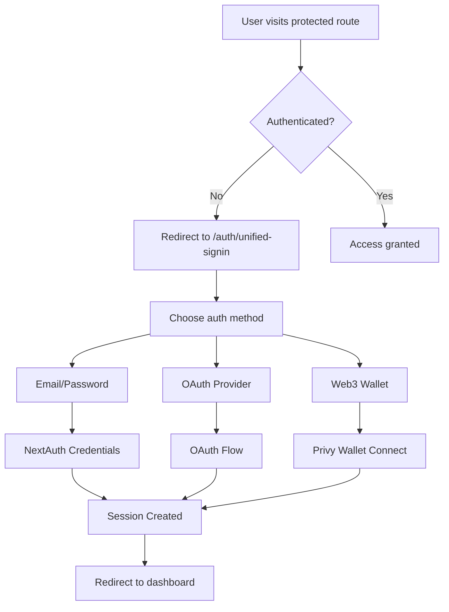

# Authentication System Documentation

## Overview

The Blockchain Consultant platform implements a comprehensive authentication system using NextAuth.js v4 with multiple authentication providers, session management, and robust security features.

## Architecture

### Core Components

1. **NextAuth.js** - Primary authentication framework
2. **Privy** - Web3/wallet authentication provider  
3. **Prisma** - Database adapter for user management
4. **JWT** - Session strategy for stateless authentication
5. **bcrypt** - Password hashing and validation

### Authentication Flow



## Authentication Providers

### 1. Credentials Provider (Email/Password)

**Configuration**: `src/lib/auth.ts`

```typescript
CredentialsProvider({
  name: 'credentials',
  credentials: {
    email: { label: 'Email', type: 'email' },
    password: { label: 'Password', type: 'password' }
  },
  async authorize(credentials) {
    // Email/password validation logic
    // Account status checking
    // Failed login tracking
    // Password verification with bcrypt
  }
})
```

**Features:**
- ✅ Email validation
- ✅ Password strength requirements (min 6 characters)
- ✅ Account locking after 5 failed attempts
- ✅ Automatic password reset email on lockout
- ✅ Account status checking (ACTIVE, SUSPENDED, etc.)
- ✅ Failed login attempt tracking

### 2. Google OAuth Provider

**Configuration**: Automatically enabled when environment variables are set

```typescript
GoogleProvider({
  clientId: process.env.GOOGLE_CLIENT_ID!,
  clientSecret: process.env.GOOGLE_CLIENT_SECRET!,
})
```

**Environment Variables:**
```env
GOOGLE_CLIENT_ID=your-google-client-id
GOOGLE_CLIENT_SECRET=your-google-client-secret
```

### 3. Twitter OAuth Provider

**Configuration**: Available but requires valid credentials

```typescript
TwitterProvider({
  clientId: process.env.TWITTER_CLIENT_ID!,
  clientSecret: process.env.TWITTER_CLIENT_SECRET!,
  version: "2.0",
})
```

### 4. Web3 Wallet Provider (Privy)

**Integration**: `src/app/auth/unified-signin/page.tsx`

```typescript
const { ready, authenticated, user } = usePrivy()
const { login } = useLogin({
  onComplete: (user, isNewUser, wasAlreadyAuthenticated) => {
    // Handle successful wallet connection
  },
  onError: (error) => {
    // Handle connection errors
  }
})
```

**Supported Wallets:**
- MetaMask
- WalletConnect
- Coinbase Wallet
- Rainbow Wallet
- And more via Privy

## Session Management

### JWT Strategy

**Configuration**: `src/lib/auth.ts`

```typescript
session: {
  strategy: 'jwt'
},
callbacks: {
  async jwt({ token, user }) {
    if (user) {
      token.role = user.role
      token.walletAddress = user.walletAddress
      token.accountStatus = user.accountStatus
    }
    return token
  },
  async session({ session, token }) {
    if (session?.user) {
      session.user.id = token.sub!
      session.user.role = token.role as string
      session.user.walletAddress = token.walletAddress as string | null
      session.user.accountStatus = token.accountStatus as string
    }
    return session
  }
}
```

### Session Data Structure

```typescript
interface Session {
  user: {
    id: string
    email: string
    name: string
    role: 'USER' | 'ADMIN' | 'TEAM_MEMBER'
    walletAddress: string | null
    accountStatus: 'ACTIVE' | 'SUSPENDED' | 'RESTRICTED' | 'DISABLED'
  }
  expires: string
}
```

## API Route Protection

### verifyAuthAndGetUser Function

**Location**: `src/lib/auth.ts`

```typescript
export async function verifyAuthAndGetUser(request?: NextRequest) {
  try {
    const session = await getServerSession(authOptions)
    
    if (!session?.user?.id) {
      return { 
        error: 'Unauthorized', 
        status: 401 
      }
    }

    const user = await prisma.user.findUnique({
      where: { id: session.user.id },
      select: {
        id: true,
        email: true,
        name: true,
        role: true,
        walletAddress: true,
        accountStatus: true,
        createdAt: true,
        updatedAt: true
      }
    })

    if (!user) {
      return { 
        error: 'User not found', 
        status: 404 
      }
    }

    return { user, session }
  } catch (error) {
    return { 
      error: 'Internal server error', 
      status: 500 
    }
  }
}
```

### Usage in API Routes

```typescript
// Example: /api/projects/route.ts
export async function GET(request: NextRequest) {
  const authResult = await verifyAuthAndGetUser(request)
  
  if (authResult.error) {
    return NextResponse.json(
      { error: authResult.error }, 
      { status: authResult.status }
    )
  }
  
  const user = authResult.user
  // Continue with authenticated logic...
}
```

## Security Features

### 1. Password Security

- **Hashing**: bcrypt with salt rounds
- **Minimum Length**: 6 characters
- **Password Reset**: Secure token-based reset flow

### 2. Account Protection

- **Failed Login Tracking**: Increments on each failed attempt
- **Account Locking**: 5 failed attempts = 30-minute lockout
- **Automatic Reset Email**: Sent on account lockout
- **Account Status**: ACTIVE, SUSPENDED, RESTRICTED, DISABLED

### 3. Session Security

- **JWT Strategy**: Stateless, secure tokens
- **CSRF Protection**: Built-in NextAuth CSRF tokens
- **Secure Cookies**: httpOnly, secure, sameSite settings
- **Session Expiry**: Configurable session timeouts

### 4. Input Validation

- **Email Validation**: RFC-compliant email checking
- **Form Validation**: Zod schema validation
- **Sanitization**: Input cleaning and validation

## Database Schema

### User Model

```prisma
model User {
  id                    String   @id @default(cuid())
  email                 String   @unique
  emailVerified         DateTime?
  name                  String?
  image                 String?
  role                  UserRole @default(USER)
  
  // OAuth IDs
  googleId              String?
  githubId              String?
  twitterId             String?
  
  // Web3
  walletAddress         String?
  
  // Security
  password              String?
  passwordResetToken    String?
  passwordResetExpiry   DateTime?
  failedLoginAttempts   Int      @default(0)
  lastFailedLogin       DateTime?
  accountLockedUntil    DateTime?
  
  // Account Management
  accountStatus         AccountStatus @default(ACTIVE)
  accountStatusReason   String?
  statusChangedAt       DateTime?
  statusChangedBy       String?
  
  // Email Verification
  emailVerificationToken   String?
  emailVerificationExpiry  DateTime?
  
  createdAt             DateTime @default(now())
  updatedAt             DateTime @updatedAt
  
  @@map("users")
}
```

### Enums

```prisma
enum UserRole {
  USER
  ADMIN
  TEAM_MEMBER
}

enum AccountStatus {
  ACTIVE
  SUSPENDED
  RESTRICTED
  DISABLED
  PENDING_VERIFICATION
}
```

## Frontend Integration

### UnifiedAuth Provider

**Location**: `src/components/providers/unified-auth-provider.tsx`

Combines NextAuth and Privy for seamless authentication experience.

### Protected Routes

**Middleware**: `src/middleware.ts`

```typescript
import { withAuth } from "next-auth/middleware"

export default withAuth(
  function middleware(req) {
    // Additional middleware logic
  },
  {
    callbacks: {
      authorized: ({ token }) => !!token
    },
  }
)

export const config = {
  matcher: ['/dashboard/:path*', '/admin/:path*']
}
```

### Login Page

**Location**: `src/app/auth/unified-signin/page.tsx`

Features:
- Tabbed interface (Social vs Email/Password)
- Provider selection dropdown
- Web3 wallet integration
- Form validation
- Error handling
- Loading states

## Error Handling

### Common Error Scenarios

1. **Invalid Credentials**
   - Message: "Invalid email or password"
   - Action: Display error, increment failed attempts

2. **Account Locked**
   - Message: "Account temporarily locked"
   - Action: Send reset email, display lockout time

3. **Account Suspended**
   - Message: "Account suspended. Contact support"
   - Action: Prevent login, redirect to support

4. **Unverified Email**
   - Message: "Please verify your email"
   - Action: Resend verification email option

5. **OAuth Errors**
   - Message: Provider-specific error messages
   - Action: Fallback to email/password option

## Testing

### Manual Test Checklist

1. **Provider Availability**
   ```
   GET /api/auth/providers
   Should return available authentication providers
   ```

2. **CSRF Protection**
   ```
   GET /api/auth/csrf
   Should return CSRF token
   ```

3. **Session Management**
   ```
   GET /api/auth/session
   Should return user session when authenticated
   ```

4. **Protected API Access**
   ```
   GET /api/user-reputation
   Should return 401 when unauthenticated
   Should return data when authenticated
   ```

### Automated Testing

**Test Suite**: `tests/auth-validation.test.js`

Run with: `node tests/auth-validation.test.js`

Tests include:
- Provider endpoint availability
- Session validation
- Protected route access
- Error handling
- Security headers

## Configuration

### Environment Variables

```env
# NextAuth Configuration
NEXTAUTH_URL=http://localhost:3001
NEXTAUTH_SECRET=your-nextauth-secret

# Database
DATABASE_URL=your-database-url

# OAuth Providers
GOOGLE_CLIENT_ID=your-google-client-id
GOOGLE_CLIENT_SECRET=your-google-client-secret
TWITTER_CLIENT_ID=your-twitter-client-id
TWITTER_CLIENT_SECRET=your-twitter-client-secret

# Privy (Web3)
NEXT_PUBLIC_PRIVY_APP_ID=your-privy-app-id

# Email Service
SMTP_HOST=your-smtp-host
SMTP_PORT=587
SMTP_USER=your-smtp-user
SMTP_PASS=your-smtp-password
```

### NextAuth Configuration

**Location**: `src/lib/auth.ts`

```typescript
export const authOptions: NextAuthOptions = {
  adapter: PrismaAdapter(prisma),
  providers: [...providers],
  session: { strategy: 'jwt' },
  callbacks: {
    jwt: async ({ token, user }) => { /* JWT callback */ },
    session: async ({ session, token }) => { /* Session callback */ }
  },
  pages: {
    signIn: '/auth/unified-signin',
    signUp: '/auth/signup',
    signOut: '/',
  }
}
```

## Deployment Considerations

### Production Security

1. **HTTPS Only**: Ensure all authentication happens over HTTPS
2. **Secure Cookies**: Configure secure cookie settings
3. **Environment Variables**: Use secure environment variable management
4. **Rate Limiting**: Implement rate limiting on auth endpoints
5. **Monitoring**: Set up authentication failure monitoring

### Database Security

1. **Connection Security**: Use SSL/TLS for database connections
2. **Access Control**: Limit database user permissions
3. **Audit Logging**: Track authentication events
4. **Backup Strategy**: Secure user data backups

## Troubleshooting

### Common Issues

1. **OAuth Provider Not Available**
   - Check environment variables
   - Verify provider configuration
   - Check redirect URIs

2. **Session Not Persisting**
   - Verify NextAuth configuration
   - Check cookie settings
   - Validate database connection

3. **Protected Routes Not Working**
   - Check middleware configuration
   - Verify `verifyAuthAndGetUser` implementation
   - Test session validation

4. **Web3 Wallet Connection Issues**
   - Verify Privy configuration
   - Check wallet compatibility
   - Test network connection

### Debug Mode

Enable debug logging in development:

```typescript
// In auth.ts
debug: process.env.NODE_ENV === 'development'
```

### Logging

Authentication events are logged with structured logging:

```typescript
log.auth('login_attempt', userId, success, context)
```

## API Reference

### Authentication Endpoints

| Endpoint | Method | Description |
|----------|--------|-------------|
| `/api/auth/providers` | GET | Get available auth providers |
| `/api/auth/signin` | POST | Sign in user |
| `/api/auth/signout` | POST | Sign out user |
| `/api/auth/session` | GET | Get current session |
| `/api/auth/csrf` | GET | Get CSRF token |

### Protected API Routes

All API routes under `/api/` (except auth routes) are protected using `verifyAuthAndGetUser()`.

### Frontend Auth Hooks

```typescript
// NextAuth hooks
import { useSession, signIn, signOut } from 'next-auth/react'

// Custom unified auth hook
import { useUnifiedAuth } from '@/components/providers/unified-auth-provider'
```

## Monitoring and Analytics

### Authentication Metrics

- Login success/failure rates
- Popular authentication methods
- Account lockout frequency
- Session duration analytics
- Error pattern analysis

### Security Monitoring

- Failed login attempt patterns
- Suspicious IP addresses
- Account enumeration attempts
- OAuth callback errors
- Session hijacking attempts

---

## Support

For authentication-related issues:

1. Check this documentation
2. Review server logs
3. Test with manual test suite
4. Contact development team

**Last Updated**: September 23, 2025
**Version**: 1.0.0